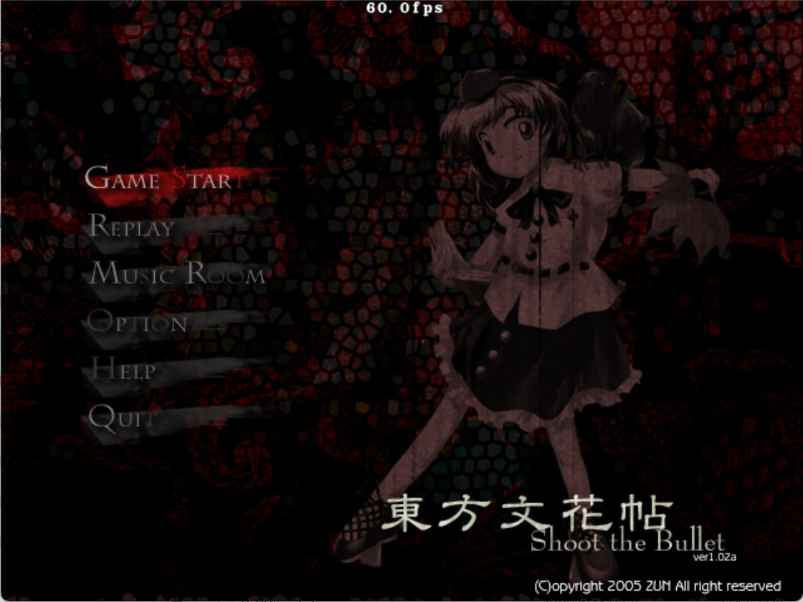
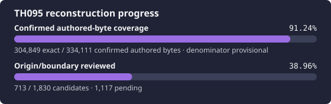

# 東方文花帖 ～ Shoot the Bullet

<p align="center">
  
</p>

<p align="center">
  
</p>

This project reconstructs the original Japanese TH095 version 1.02a
executable. Reproducible byte comparison against one hash-attested target is
the acceptance criterion.

## Exact target

Supply your own legal copy as `resources/th095.exe`:

| Property | Required value |
| --- | --- |
| Version | original Japanese 1.02a |
| Size | `696,832` bytes |
| SHA-256 | `bb54f6fc54f0eeffaec416ca9f64aef32b5f59b7427fa5a6579f6538e0eddc07` |
| MD5 | `8de95bc7651419201fc1a4ea49bc0697` |
| Image base | `0x00400000` |
| Entry point | `0x00486A9D` |

The target identifies itself as `Shoot the Bullet. ver 1.02a`. The
[official 1.02a update post](https://kourindou.exblog.jp/2461295/) links the
`th095_ver102a.exe` updater used to produce the final Japanese version.

```bash
scripts/import-target.sh /path/to/th095.exe
python3 scripts/verify-target.py
```

Copyrighted executables, game data, and private analysis databases are not
included.

## Current status

TH095 is in active reconstruction. An attested Ghidra 12.1.3 headless import
supplies 1,830 provisional function candidates. Eighty-three canonical units now
reproduce 75,712 authored bytes exactly, including the complete 17,018-byte
`AnmManager::ExecuteScript`, 27,091-byte `EclManager::RunEcl`, the
target-specific asynchronous `SoundPlayer` core, and the exact Main/D3D
runtime family. The TH095-specific replay lifetime, chain-registration,
per-frame input/FPS stream, disk/archive loading, compressed replay writing,
USER metadata, and playback display path is also exact. A target-local audit
has now admitted 59,827 additional bytes
from the photography/camera, replay/menu, and gameplay/resource clusters, so
exact coverage is 59.92% of the expanded 126,355-byte authored set. The global
denominator remains provisional while origin review continues. Mapping, source
presence, semantic validation, and exact matches are deliberately tracked as
independent states.
The aspirational reconstruction target is 99.5% of that conservative authored
denominator, but difficult units remain uncredited rather than weakening the
exact-match standard.

The pinned compiler is Microsoft Visual C++ .NET 2003
`13.10.3077`, matching the target's PE/Rich-header evidence. The
`/Od /Ob1 /Oi /Gr` main translation-unit profile is proven across seventeen
accepted Main/D3D units. The exact ANM and ECL VM units independently prove
the same optimization/inlining shape for their bounded translation units. The
reconstructed SoundPlayer lane also uses `/Od /Ob1`; profiles elsewhere
remain unclassified.

Start a reconstruction session with:

```bash
scripts/bootstrap-tools.sh
python3 scripts/verify-target.py
python3 scripts/ghidra.py check
python3 scripts/report-reconstruction-status.py --summary
python3 scripts/validate-tracking.py --require-target
```

## Documentation

- [Current handoff](docs/RE_HANDOFF.md)
- [Architecture and exact target](docs/ARCHITECTURE.md)
- [Reverse-engineering workflow](docs/RE_WORKFLOW.md)
- [Independent oracle policy](docs/ORACLES.md)
- [Ghidra setup and attestation](docs/GHIDRA.md)
- [VC7.1 build and strict matching](docs/BUILD_MATCHING.md)
- [Tool routing](docs/TOOLS.md)
- [Verified knowledge base](docs/KNOWLEDGE_BASE.md)
- [Generated progress](docs/PROGRESS.md)
- [Agent rules](AGENTS.md)

Run public, target-independent checks with `python3 scripts/ci.py`. Private
target and Ghidra checks remain separate from public CI.

## Reference model

The control plane follows the conservative in-progress model from
[N0zoM1z0/th105](https://github.com/N0zoM1z0/th105). The completed
[N0zoM1z0/th08](https://github.com/N0zoM1z0/th08) project is a secondary source
for strict comparison and Ghidra workflow patterns. Neither repository is
binary evidence for TH095, and completed port infrastructure is intentionally
out of scope during bring-up.

## License

Repository-authored code and documentation are provided under the MIT License.
This does not grant rights to the original game or its assets.
