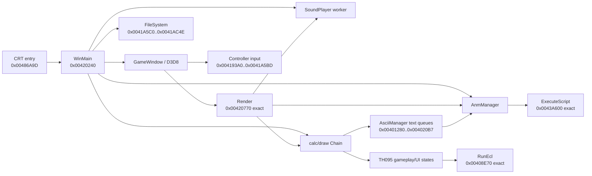

# Architecture and exact target

## Scope

TH095 reconstructs the original Japanese `東方文花帖 ～ Shoot the Bullet`
version 1.02a executable. The project currently covers source reconstruction
and exact comparison only. Playable ports, asset extraction, localization, and
distribution of original files are out of scope.

## Binary inventory

The canonical target is pinned in `config/target.toml`.

| Property | Observed value |
| --- | --- |
| File size | `696,832` bytes |
| SHA-256 | `bb54f6fc54f0eeffaec416ca9f64aef32b5f59b7427fa5a6579f6538e0eddc07` |
| Format | PE32 i386 GUI executable |
| Image base | `0x00400000` |
| Entry point | `0x00486A9D` |
| `.text` virtual extent | `0x00401000..0x004942A7` |
| Relocations | stripped |
| Linker | Microsoft `7.10` |

The executable has five sections: `.text`, `.rdata`, `.data`, `.data1`, and
`.rsrc`. Section RVAs, virtual sizes, and raw extents are recorded in the
target manifest rather than duplicated here.

## Toolchain boundary

The PE and Rich header identify the Visual C++ .NET 2003 generation. Rich
records use build `3077`; the pinned compiler and linker independently report
`13.10.3077` and `7.10.3077`. This establishes the compiler build, not the
complete build profile. Optimization, inlining, runtime selection, exception
settings, floating-point flags, library provenance, and translation-unit
partitioning must be recovered per bounded unit.

## State model

The repository deliberately separates five questions:

| State | Durable source | Meaning |
| --- | --- | --- |
| Candidate boundary | `config/functions.csv` | Initial Ghidra import or later IDA review found a possible extent |
| Origin | `config/function-origins.csv` | Authored/library/compiler classification |
| Mapping | `config/reccmp-functions.csv` | A durable target address has a source name |
| Source presence | `config/implemented.csv` | A mapped function has a maintained implementation |
| Exactness | `config/matches.csv` | A canonical unit reproduces all accepted bytes |

No state promotes another automatically. In particular, an IDA/Ghidra
function, name, decompile, or successful compilation is not an exact result.

## Recovered runtime spine

The CRT entry at `0x00486A9D` calls `WinMain` at `0x00420240`. Target control
flow and TH08 corroboration establish the following high-level ownership:

`WinMain` owns the complete process lifecycle: it disables system power UI,
initializes seven Supervisor critical sections, enforces a single instance,
loads or repairs the 200-byte configuration, creates the D3D8 interface and
window, starts the sound worker, constructs the `0x38314c`-byte `AnmManager`,
runs the message/frame loop, recovers a lost D3D device, supports a settings
restart path, and releases subsystems in reverse order.

The exact Render unit proves these shared edges and field offsets:

| Target | Recovered role | Exact evidence |
| --- | --- | --- |
| `0x00401B70` | `BackgroundSupervisorView::ConfigureBackgroundViewport` | Canonical VC7.1 body and `ApplyBackgroundViewport` REL32 |
| `0x00401D30` / `0x00402010` | `AsciiManager` constructor/destructor | Canonical VC7.1 member construction/destruction and twelve relocations |
| `0x00401EB0` / `0x00401F10` | `AnmVm` / `AnmVmBase` constructors | Canonical derived and implicit-COMDAT base bodies |
| `0x00404B10` | `Supervisor::ConfigureGameplayViewport` | Render REL32 |
| `0x00418C40` / `0x00418DA0` | calc/draw chain dispatch | Render REL32 |
| `0x00439200` | `SoundPlayer::ProcessQueues` | Render REL32 |
| `0x0043F2B0` / `0x0043F2F0` | clear/flush ANM vertex buffer | Render REL32 |
| `0x004C4670 + 0x1CC` | frameskip configuration | Render DIR32 addend |
| `0x004C4670 + 0x768` | fog-state cache | Render DIR32 addend |
| `GameWindow + 0x34/+0x3C/+0x44` | current/last/next frame timestamps | exact instructions |

## Target-wide hub inventory

The historical attested Ghidra inventory exported 1,830 function metric rows
and 3,873 direct call edges from the target. The ranking deliberately combines
size, incoming callers, internal fan-out, referenced global state, strings,
and branches so reconstruction work is not biased toward isolated leaves.

| Address | Size | Connectivity | Current classification | Lane value |
| --- | ---: | ---: | --- | --- |
| `0x00408E70` | 27,091 | 3 callers / 50 internal callees | exact `EclManager::RunEcl` | Largest script VM; establishes enemy/scene semantics |
| `0x0043A600` | 17,018 | 22 callers / 20 internal callees | exact `AnmManager::ExecuteScript` | Widely shared animation VM and type/layout root |
| `0x00447D00` | 16,066 | 1 caller / 27 internal callees | boundary-reviewed authored scene-selection hub | 12-group scene UI; exact class name unresolved |
| `0x0042C5C0` | 8,560 | 1 caller / 4 internal callees | source-present photo-stage display builder | Repeated TH095 photograph HUD/glyph builder; exact 118-byte VM initializer |
| `0x00430AB0` | 7,271 | 1 caller / 29 internal callees | source-present camera/photo state machine | Complete TH095 camera semantics; compiler-local residuals deferred |
| `0x00426BF0` | 6,471 | 1 caller / 17 internal callees | boundary-reviewed authored replay/menu dispatcher | Eleven-function replay/best-shot cluster |
| `0x0042AD60` | 5,309 | 1 caller / 16 internal callees | source-present photo-stage state machine | Capture crop, texture, best-shot, animation, and boundary-fade owner |
| `0x00403440` | 5,129 | 1 caller / 6 internal callees | source-present Background stage interpreter | TH095 variable-size camera/photo script, Hermite/easing, and four motion modes |
| `0x00402250..0x00402E90` | 1,760 | lifecycle, three callbacks, loader, VM updater | six exact / three source-present Background functions | Connects selected-scene stage data to the TH095 camera, eight stage VMs, and three photograph-border VMs |
| `0x00402750..0x00403431` | 2,279 | draw coordinator / renderer / culler | one exact / three source-present Background functions | Four stage layers, fog and viewport camera state, plus TH095's clamped photograph depth mask |
| `0x0042F190` | 3,463 | 1 caller / 6 internal callees | source-present photo-game main state | Complete movement/focus/animation/bounds/history loop; compiler-local residuals deferred |
| `0x00439200` | 2,525 | 2 callers / 16 internal callees | `SoundPlayer::ProcessQueues` | Shared threaded audio state machine |
| `0x00420240` | 1,326 | CRT root / 30 internal callees | `WinMain` | Process-level ownership and subsystem naming |
| `0x00401000..0x00401D2F` | 2,802 source-present bytes | three Chain callbacks / shared text consumers | eleven exact / four compiler-observed ASCII functions | Global regular/GUI queues, score/time popups, four inline ANM VMs, and TH095 viewport-aware glyph rendering |

The first large-function lane, `AnmManager::ExecuteScript`, is exact for its
17,018-byte authored body. Its canonical unit also compares the complete
17,426-byte COFF extent, including three compiler-owned switch tables and all
333 relocations. This establishes the ANM VM layout, 89-opcode dispatch, update
tail, and VC7.1 `/Ob1` source-shape profile. The second large-function lane,
`EclManager::RunEcl`, is exact for its 27,091-byte authored body and complete
27,747-byte COFF extent, including the 158-entry opcode table, six-entry
easing table, and all 647 relocations. A subsequent target-local audit admitted
32 functions and 55,476 bytes across the camera/photo, replay/menu, and
gameplay/resource clusters. Five exact save/unlock helpers now prove that
`0x00447D00` manages TH095's twelve-group scene-selection UI rather than a
traditional stage loop. The adjacent 716-byte preview/status updater at
`0x0044BBD0` is source-present with its 78-byte bounded-queue dependency
exact. Its staged 1,989-byte preview-text builder at `0x0044BEA0` and 128-byte
rolling-key text decoder at `0x0044D020` are now exact. The adjacent
2,278-byte scene-detail updater at `0x0044C670` and its three VM helpers are
also exact. Target evidence now identifies `0x0044DCA0` as the TH095-specific
4-by-20 replay browser rather than a scene-select state updater. Its complete
2,054-byte topology is source-present with all 77 relocations resolved; the
306-byte critical-section slot loader and 21-byte exit setter are exact. The
10,103-byte options state machine at `0x0044E4B0` is source-present and
its controller dependency chain at `0x004193A0..0x00419ADB` is exact for
another 1,820 bytes. The complete `Controller::GetInput @ 0x00419AE0` source
proves TH095's two independently assigned devices, third aggregate input slot,
and per-bit repeat/pressed/released histories; its seven-byte compiler-shape
residual remains uncredited. The adjacent 110-byte keyboard reset and four
FileSystem functions at
`0x0041A550..0x0041AC4E`, now exact for another 1,789 bytes. The FileSystem
cluster proves the shared replay/resource codec, archive/disk loader, and
critical-section-2 accounting. The Supervisor draw spine now has target-local
ownership: `OnDraw2 @ 0x004235D0` is the priority-0 viewport/prompt/surface
callback, while exact `DrawFpsCounter @ 0x00423790` is priority `0x17` and
bridges exact `CalculateFps @ 0x00424720` into the regular ASCII queue. The
calculator also owns the shared replay/photo slow-rate accumulators and QPC
anomaly fallback. Exact priority-`0x1E` `FinalizeFrame @ 0x00423840` flushes
the ANM vertex buffer and publishes `frameskipConfig + 1` into that frame count
under critical section 5; exact `InitializeInput @ 0x004238E0` publishes the
keyboard/controller availability flags around the exact DirectInput setup owner.
That owner and its two exact callbacks establish the `DIDEVCAPS` at `+0x18`,
first-attached-controller policy, and TH095 joystick range of `[-1000,1000]`.
The exact worker wrapper establishes `InitializeInput` as a fastcall callback;
the adjacent exact release helper owns the front-end/photo-game pointers at
`Supervisor+0x780/+0x784`. Exact `AddedCallback @ 0x00423E70` is their upstream
startup coordinator: it initializes viewports/RNGs, stages the archive, score,
surface, ANM, vertex/text buffers, and launches both early workers plus the main
startup worker. The front-end
Help page at `0x00451C80` is now
source-present with an exact 88-byte asynchronous loader callback; the
adjacent Music Room at `0x00450FC0` is source-present with both parser helpers
exact. The adjacent `0x00452630` function is now source-present as the shared
scene-result/replay-browser text renderer; exact wrappers at
`0x00445E40/0x00445E60` prove its ownership alongside the
2,969-byte shared update dispatcher at `0x00445E80`. The dispatcher is now
source-present for its complete ten-state and 50-call topology. Its 3,299-byte
main-menu child at `0x00446A50` is also source-present for the complete six-row
navigation, idle-demo launch, and page-transition flow; its 648-byte close and
787-byte selection fan-out helpers are exact. The 16,066-byte scene-selection
hub is now source-present for its complete 275-call group/scene cursor,
asynchronous preview, record-detail, and transition topology. Its shared
136-byte D3D texture clear is exact. The 3,070-byte mission/face asset worker
is now source-present for its exact 38-call topology. Its 1,034-byte best-shot
file decoder/checksum validator is also source-present with the exact twelve-call
distribution. The decoder's shared 8 KiB-ring decompressor is source-present,
and its 83-byte aligned additive checksum dependency is canonical exact. The
selector/Help texture path is canonical exact from format conversion through
full and regional D3D uploads and three-format alpha bleed, including the full
1,292-byte bleed body and its compiler-owned switch tables. The adjacent exact
`AnmManager::SetupVertexBuffer @ 0x00442260` also establishes the managed
80-byte quad buffer and the four-entry software fallback vertex array at
`0x004CA290`.

## Shared engine versus TH095 gameplay

The window, D3D8, chain, sound, ANM, and ECL layers share clear ancestry with
TH08. Exact TH08 source is used to seed names, layouts, opcode enums, and
compiler source shape, then revalidated against TH095.

Above that boundary, TH095 is structurally different from a traditional
Touhou stage shooter. Target strings and state machines expose scene
selection, photography/camera behavior, best-shot and total-score displays,
and replay registration. Those types are intentionally left with descriptive
lane labels until target-local callers and layouts prove class names.

The live-play object at `0x004C4E70` is identified independently by the
target's `initialize PlayerInf` and `shutdown PlayerInf` strings. Its exact
`0x0042EFB0` creation spine registers three callbacks and owns the surrounding
constructor, resource initialization, SHT loading, draw, collision, death, and
destruction cluster. Fifteen PlayerInf units are canonical exact for 2,136
authored bytes; the larger movement and camera-state bodies remain
source-present without claiming compiler-local frame residuals as exact.

## Reference repositories

`N0zoM1z0/th105` supplies the in-progress control-plane shape. `N0zoM1z0/th08`
supplies mature Ghidra and exact-comparison patterns. They are workflow and
adjacent-engine corroboration only. TH095 addresses, ABI details, layouts,
names, and behavior must be confirmed against the v1.02a target.
